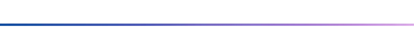

# Olá, sou a Ana!

Analista de dados com enfâse em prevenção à fraude e graduada em Sistemas de Informação, atualmente cursando estatística, transformando informações simples em insights estratégicos poderosos.

 
</img>

 <h2 align="left"> 💡​ Projetos</h1>

| Projeto | Descrição | Acesse aqui
| ------- | --- | --- |
| Bank abc credit | Desenvolvimento de Machine Learning para predições futuras sobre um novo produto.| [Clique aqui](https://github.com/Anameliti/bank-abc-credit-machine-learning)
| Teo Me Why Program Loyalties | Análise em SQL e dataviz para identificar melhorias em um programa de fidelidade | [Clique aqui](https://github.com/Anameliti/teomewhy-loyalties-program)
| E-book Machine Learning | Criação de um ebook utilizando IAs no desenvolvimento | [Clique aqui](https://github.com/Anameliti/create-ebook-prompts)
| AnalitycsQuest | Podcast criado sobre o mundo DataScience utilizando IAs | [Clique aqui](https://github.com/Anameliti/podcast-prompts-by-ia)

 
</img>

<h2 align="left"> 🦄​ SKILLS</h2>

    

 
</img>

<h2 align="left">
  💌 Conecte-se comigo: ⤵️
</h2>

 </img> </img> 
